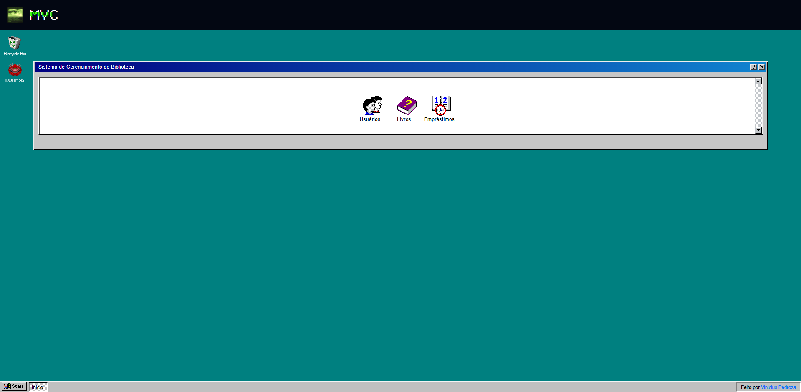
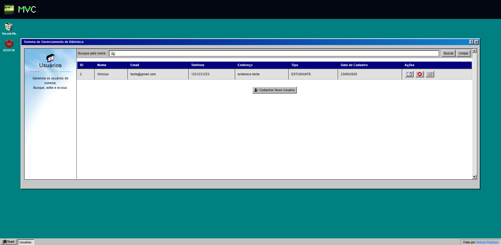
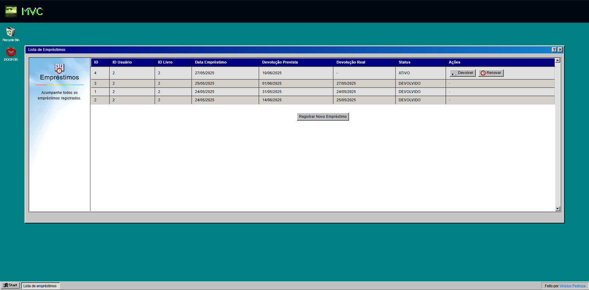
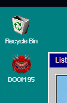
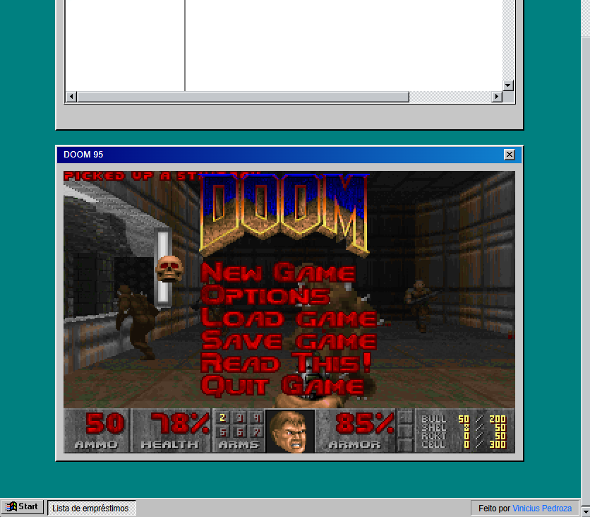

# Sistema de Gerenciamento de Biblioteca - Estilo Windows 98 (e Doom 👹)

Uma aplicação web de **Sistema de Gerenciamento de Biblioteca** desenvolvida com **Java**, usando o padrão **MVC (Model-View-Controller)**, com interface inspirada no **Windows 98** e ambientação sonora/visual no estilo **DOOM**.

Criado como prática da disciplina **Desenvolvimento para Web com Java**, utilizando **Apache Tomcat** e **JSP/Servlets**, com aquele toque retrô que faltava nos seus sistemas de biblioteca.

## 🎯 Funcionalidades

- **Gerenciamento de Usuários:** Cadastre, consulte, edite e remova usuários da biblioteca
- **Controle de Livros:** Sistema completo de catalogação de livros
- **Sistema de Empréstimos:** Registre empréstimos, controle devoluções e renovações
- **Interface Estilo Win98:** Totalmente nostálgica, inspirada no sistema da década de 90
- **MVC Separadinho:** Cada camada no seu lugar, sem bagunça
- **DOOM Launcher:** Experiência interativa com mini Doom rodando via navegador

## 🎨 Créditos Visuais e Interativos

- **Ícones Win98 coletados de:** [Alex Meub – Windows 98 Icons](https://win98icons.alexmeub.com/)  
  Projeto incrível que inspirou o visual da aplicação e forneceu vários ícones.

- **Launcher de DOOM utilizado via:** [js-dos – DOOM in the Browser](https://js-dos.com/)  
  Engine para jogos MS-DOS diretamente no navegador. Perfeita para trazer aquele clima de LAN House raiz.

## 🛠️ Tecnologias Utilizadas

### Linguagens e Plataformas:
- <a href="https://www.java.com/" target="_blank"></a>
  
- <a href="https://www.mysql.com/" target="_blank"></a>
  

### Frameworks e Ferramentas:
- <a href="https://tomcat.apache.org/" target="_blank"></a>
  
- <a href="https://getbootstrap.com/" target="_blank"></a>
  
- <a href="https://fontawesome.com/icons" target="_blank"> </a>
  
- **JSP + Servlets**
- **JDBC** (Java Database Connectivity)

## 🏗️ Estrutura MVC

- **Model:** Representação dos dados e lógica do negócio
- **View:** Telas JSP com ícones estilo Win98
- **Controller:** Servlets para gerenciar as ações da aplicação

## 🗄️ Banco de Dados

### Exemplo de tabelas usadas (MySQL):

```sql
-- Tabela de Usuários
CREATE TABLE usuario (
    id INT AUTO_INCREMENT PRIMARY KEY,
    nome VARCHAR(100) NOT NULL,
    email VARCHAR(100) UNIQUE NOT NULL,
    telefone VARCHAR(20),
    endereco VARCHAR(200),
    tipo ENUM('ESTUDANTE', 'PROFESSOR', 'FUNCIONARIO') NOT NULL,
    data_cadastro DATE NOT NULL
);

-- Tabela de Livros  
CREATE TABLE livro (
    id INT AUTO_INCREMENT PRIMARY KEY,
    titulo VARCHAR(200) NOT NULL,
    autor VARCHAR(100) NOT NULL,
    isbn VARCHAR(13) UNIQUE,
    categoria VARCHAR(50),
    disponivel BOOLEAN DEFAULT TRUE
);

-- Tabela de Empréstimos
CREATE TABLE emprestimo (
    id INT AUTO_INCREMENT PRIMARY KEY,
    id_usuario INT NOT NULL,
    id_livro INT NOT NULL,
    data_emprestimo DATE NOT NULL,
    data_prevista_devolucao DATE NOT NULL,
    data_real_devolucao DATE NULL,
    status ENUM('ATIVO', 'DEVOLVIDO', 'RENOVADO') DEFAULT 'ATIVO',
    FOREIGN KEY (id_usuario) REFERENCES usuario(id),
    FOREIGN KEY (id_livro) REFERENCES livro(id)
);
```

### Conexão via JDBC:

```java
String url = "jdbc:mysql://localhost:3306/nomedobanco";
String user = "root";
String password = "sua_senha";
```

## 🚀 Como Rodar o Projeto

### Pré-Requisitos

- **JDK 17+**
- **Apache Tomcat 10+**
- **MySQL** rodando localmente
- **IDE Java** (Eclipse, IntelliJ, VS Code com plugins)

### Passos

1. **Clone o repositório:**
   ```bash
   git clone https://github.com/viniciuslft/biblioteca-mvc.git
   cd biblioteca-mvc
   ```

2. **Importe como Dynamic Web Project** em sua IDE.

3. **Ajuste os dados da conexão** com o banco nos arquivos DAO (UsuarioDAO.java, LivroDAO.java, EmprestimoDAO.java).

4. **Crie as tabelas** no seu MySQL (vide estrutura acima).

5. **Suba no Apache Tomcat:**
   ```bash
   http://localhost:8080/biblioteca-mvc/
   ```

6. **Pronto!** Curta o sistema de biblioteca com clima nostálgico, doom e clique retrô.

## 📁 Estrutura de Pastas

```
biblioteca-mvc/
├── src/
│   ├── main/
│   │   └── java/
│   │       ├── model/
│   │       │   ├── Usuario.java
│   │       │   ├── Livro.java
│   │       │   └── Emprestimo.java
│   │       ├── dao/
│   │       │   ├── UsuarioDAO.java
│   │       │   ├── LivroDAO.java
│   │       │   └── EmprestimoDAO.java
│   │       └── controller/
│   │           ├── UsuarioServlet.java
│   │           ├── LivroServlet.java
│   │           └── EmprestimoServlet.java
├── web/
│   ├── view/
│   │   ├── assets/
│   │   │   ├── css/
│   │   │   │   └── win98-style.css
│   │   │   ├── img/
│   │   │   │   ├── icons/
│   │   │   │   └── readme/
│   │   │   └── js/
│   │   ├── usuario/
│   │   │   ├── listar.jsp
│   │   │   └── form.jsp
│   │   ├── livro/
│   │   │   ├── listar.jsp
│   │   │   └── form.jsp
│   │   ├── emprestimo/
│   │   │   ├── listar.jsp
│   │   │   └── form.jsp
│   │   └── index.jsp
└── WEB-INF/
    └── web.xml
```

## 🎮 Screenshots

### 🏠 Tela Principal - Sistema de Gerenciamento de Biblioteca

*Interface principal com ícones nostálgicos do Windows 98 - Usuários, Livros e Empréstimos*

### 👥 Gerenciamento de Usuários
  
*Tela de cadastro e consulta de usuários com funcionalidades completas de CRUD*

### 📚 Lista de Empréstimos

*Sistema de controle de empréstimos com status, datas e ações de devolução/renovação*

### 🎯 Ícones do Desktop

*Desktop nostálgico com ícones de Recycle Bin e DOOM 95*

### 👹 DOOM 95 Integrado

*O clássico DOOM rodando direto no navegador*

## 🤝 Contribuição

Contribuições são bem-vindas! Sinta-se à vontade para:

- Reportar bugs
- Sugerir novas funcionalidades
- Adicionar mais elementos nostálgicos